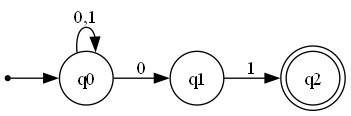
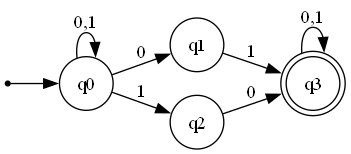
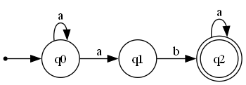
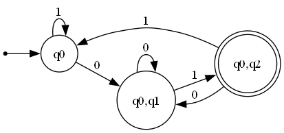
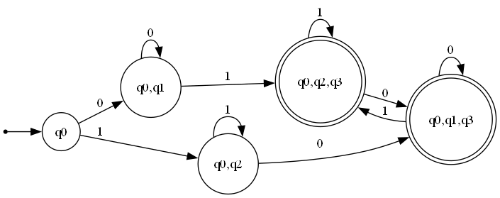

# Theory of Computation

## Assignment2

### Student's Information

- Name: Hongzhen Zhao

- Email: zhao13477@gtiit.edu.cn

- Name: Lobna Ghanim

- Email: lobna.ghanim@gtiit.edu.cn

Submission deadline: June 9

### Description of implementation and design decisions

#### Implementation Overview

The implementation of NFA is almost the same as DFA except for the 
member function `accepts` where we use a different strategy.<br>

- Members of `NFiniteAutomaton`
  
  ```py
    @member_states: set of all states. Each element must be of string type.<br>
    @member_initialState: the initial state which belongs to states.<br>
    @member_finalStates: set of all final states which must be the subset of states.<br>
    @member_alphabet: alphabet of the set form. Every letter from alphabet must have only single character!<br>
    @member_tFunction: the tFunction is in dictionary form. Key is of the form (state, letter), Value is state.<br>
    @member_oStates: set of possible output of the transition function.
    @member_iStates: set of possible states input of the transition function.
    @member_iLetters: set of possible letter from alphabet of the transition function.
  ```

- Member function `accept`<br>
  *This function applies the other member function `__search_NFA`*
  
  ```py
  Check if a tring is accepted by the finite automaton machine.<br>
    @param_string: string need to check. It cannot be empty!<br>
    @return: returns true if the string is accepted, Otherwise it returns false.
  ```

- Member function `__search_NFA`<br>
  *Note that it is a auxiliary function so invoking it outside the class is prohibited.*<br>
  *This function checks whether a string is accepted by a NFA by means of recursion. It explores all possible paths through the automaton for the input string.*<br> 
  
  ```py
  Check if a string is accepted by the finite automaton machine.<br>
    @param_string: string need to check. It cannot be empty!<br>
    @return: returns true if the string is accepted, Otherwise it returns false.
  ```

- Member function `show_transition_function`
  
  ```py
    This function shows the transition function of this NFA.
  ```

- Member function `transfer_to_DFA`
  
  *This function uses the algorithm of lazy construction*
  
  ```py
  
  ```

```
### Description of tests and results
#### Results NFA1
<br>
Example 1: checks if a string has a suffix 01.

#### Results NFA2
<br>
Example 2: accepts all strings over {0, 1} that contains either the substring "01" or "10".

#### Results NFA3
<br>
Example 3: equivalent to the RE: `a+ba*`.

```sh
NFA1
0101 is accepted
1101 is accepted
01 is accepted
000 is not accepted
0110 is not accepted
1011 is not accepted
NFA2
0101 is accepted
1101 is accepted
10 is accepted
000 is not accepted
111 is not accepted
1 is not accepted
NFA3
aaba is accepted
aaab is accepted
ab is accepted
aabbaaa is not accepted
bba is not accepted
aaa is not accepted
```

#### Results DFA1



DFA converted from NFA1.

#### Results DFA2



DFA converted from NFA2.

#### Results DFA3


DFA converted from NFA3.

This program can successfully transfer DFA into NFA, the test result is as follow:

```sh
DFA1
0101 is accepted
1101 is accepted
01 is accepted
000 is not accepted
0110 is not accepted
1011 is not accepted
DFA2
0101 is accepted
1101 is accepted
10 is accepted
000 is not accepted
111 is not accepted
1 is not accepted
DFA3
aaba is accepted
aaab is accepted
ab is accepted
aabbaaa is not accepted
bba is not accepted
aaa is not accepted
```
